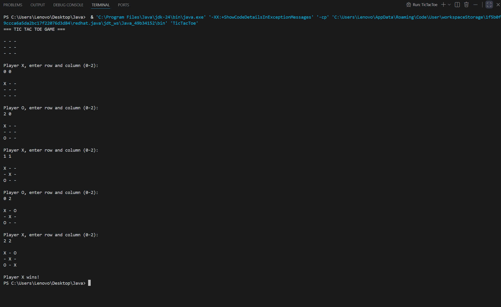

# 🎮 Tic Tac Toe Game

## 📖 Overview
Tic Tac Toe is a simple console-based Java game for two players. Players take turns placing their symbols (**X** and **O**) on a 3×3 board. The first player to align three symbols horizontally, vertically, or diagonally wins the game. If all cells are filled and no player wins, the game ends in a draw.

---

## ✨ Features
- Two-player gameplay
- 3×3 game board
- Win detection
- Draw detection
- Input validation
- Console-based user interface

---

## 🛠️ Technologies Used
- Java
- Scanner Class
- Arrays
- Loops and Conditional Statements

---

## 📂 Project Structure

```
TicTacToe/
│
├── TicTacToe.java
└── README.md
```

---

## ▶️ How to Run

### Step 1: Compile the Program
```bash
javac TicTacToe.java
```

### Step 2: Run the Program
```bash
java TicTacToe
```

---

## 🎮 How to Play
1. The game starts with Player **X**.
2. Enter the row and column numbers (0–2) where you want to place your symbol.
3. Players take turns alternately.
4. The first player to get three symbols in a row, column, or diagonal wins.
5. If the board is completely filled without a winner, the game is declared a draw.

---

## 📸 Sample Output

```text
Current Board:

- - -
- - -
- - -

Player X, enter row and column: 0 0

X - -
- - -
- - -

Player O, enter row and column: 1 1

X - -
- O -
- - -
```

---

## 📸 Screenshot




## 🧠 Concepts Used
- Methods
- Arrays
- Loops
- Conditional Statements
- User Input Handling
- Game Logic

---

## 🚀 Future Enhancements
- Single-player mode with AI
- GUI using Java Swing
- Score tracking system
- Restart game option
- Online multiplayer support

---

## 👨‍💻 Author
**Ashirbada Behera**

A beginner-friendly Java project developed to practice programming fundamentals and game logic implementation.
